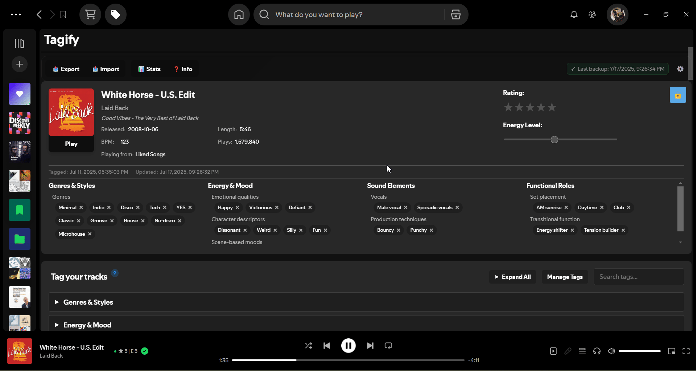
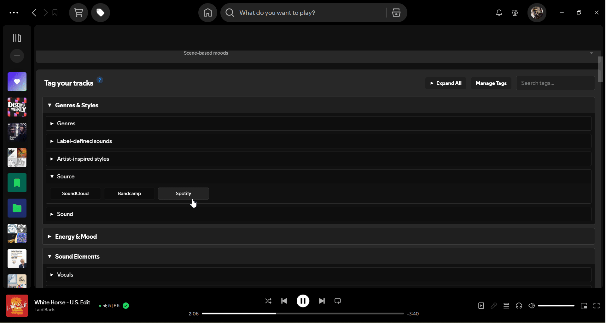
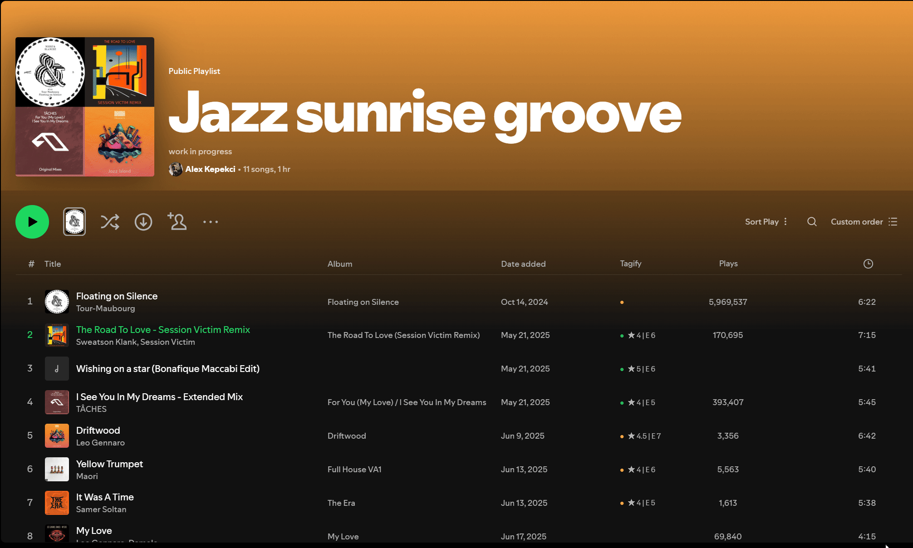

# Tagify - Music Tagger & Organizer for Spotify

Tagify is a powerful [Spicetify](https://github.com/spicetify/cli) custom app that brings advanced music tagging and organization capabilities to Spotify.

> Tag, rate, and organize your Spotify library like never before. 


🔗 **[tagify.fm](https://www.tagify.fm)**

[](https://discord.gg/C4qbPUbBKV)
[](https://github.com/alexk218/tagify/releases)
[](https://github.com/alexk218/tagify/discussions)
[](https://buymeacoffee.com/alexk218)

## See Tagify in action
[](https://www.youtube.com/watch?v=iDsSasHFOJQ)


## Motivation

After years of failed attempts to organize my 10,000+ track collection, I built the tool I always wished existed: a way to tag, rate, and find music the way your brain thinks about it.

---

### **Track Tagging**

Rate tracks, set energy levels, and apply custom tags. Turn vague music memories into organized, searchable data.



### **Creating & Managing Tags**

Build your own tag system that matches how _you_ think about music.



### **Smart Filtering & Playlist Creation**

Create playlists by filtering by any combination of tags, ratings, energy, and BPM.


### **Bulk Tagging Multiple Tracks**

Select multiple tracks and apply tags in bulk.




---

## Install Tagify

### **Automatic Installer / Updater**
[Tagify Installer for Windows](https://github.com/alexk218/tagify-installer/releases/latest)

This installs Spicetify and Tagify. Keep this installed, as it will handle all Spicetify and Tagify updates in the future.

Coming to macOS & Linux soon!

## Manual Install (required for macOS & Linux)

### Prerequisites

You'll need **Spicetify** installed on your computer.

➡️ **[Complete Spicetify Installation Guide](SPICETIFY_INSTALLATION.md)**

### Windows

Open **Powershell** and run this command:

```powershell
iwr -useb "https://raw.githubusercontent.com/alexk218/tagify/main/install.ps1" | iex
```

### macOS/Linux

Open **Terminal** and run:

```bash
curl -fsSL "https://raw.githubusercontent.com/alexk218/tagify/main/install.sh" | bash
```

## Community & Support
Join the community and influence Tagify's roadmap.
- 💬 **Discord**: [Chat with other users, share workflows, and get early previews](https://discord.gg/C4qbPUbBKV)
- 💡 **Feature requests & bug reports**: [Discussions Forum](https://github.com/alexk218/tagify/discussions)
- 🚀 **Shape Tagify's future:** [Give feedback](https://forms.gle/H4xMyNC2zVAHowPF6)

## Support me ☕
Many coffees were consumed in the making of Tagify. 

If you enjoy Tagify and want to support its development, consider [contributing to my next one](https://buymeacoffee.com/alexk218) :)

Thank you.
