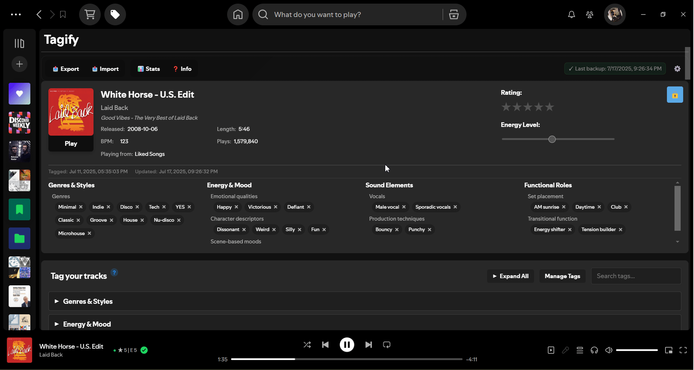
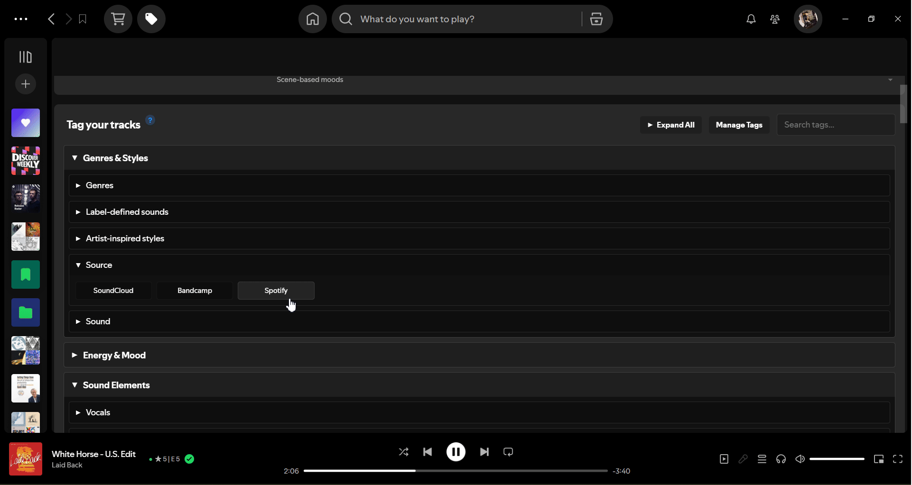
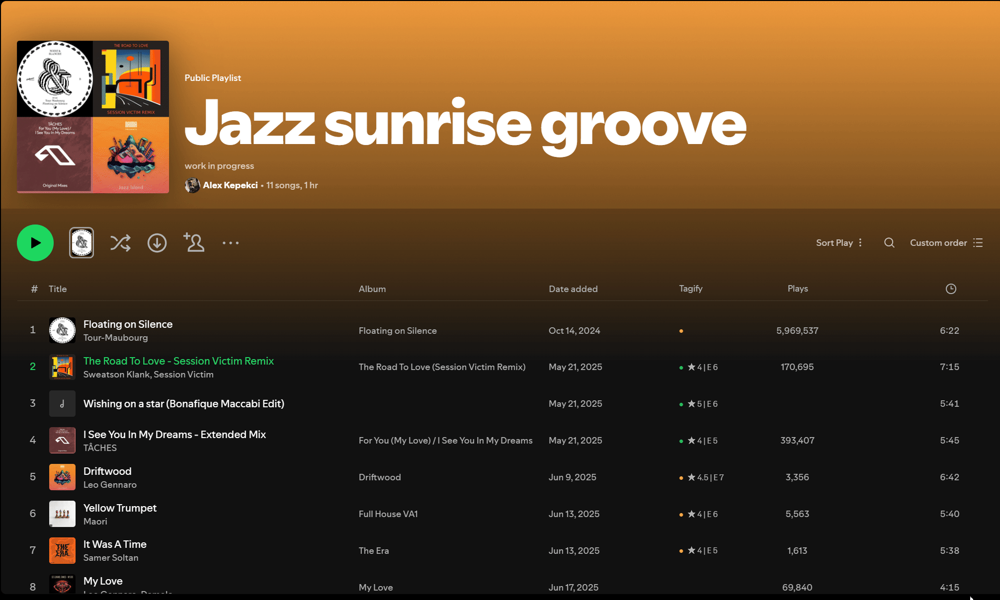

# Tagify: music tagging and playlist organization for Spotify

Tag, rate and organize your Spotify library your own way: custom tags, energy levels, star ratings, and smart playlists built from them, right inside the Spotify desktop app. Tagify is a free, open source [Spicetify](https://github.com/spicetify/cli) custom app.

[](https://github.com/alexk218/tagify/releases)
[](https://github.com/alexk218/tagify/discussions)
[](https://buymeacoffee.com/alexk218)


## Demo

Check out a video walkthrough of Tagify in action: [YouTube demo](https://www.youtube.com/watch?v=0N1yp8--mTQ)

## No install? Use it in your browser

Tag your Spotify and Apple Music songs on any device at [tagify.fm](https://tagify.fm), and see how other people tag the same music. Nothing to install.

## Motivation

After years of failed attempts to organize my 10,000+ track collection, I built what every lover of music needs: a way to tag, rate, and find music the way your brain thinks about it.

---

### **Tag songs on Spotify**

Rate tracks, set energy levels, and apply custom tags. Turn vague music memories into organized, searchable data.



### **Build your own tag system**

Build your own tag system that matches how _you_ think about music.



### **Smart playlists and filtering by tag, rating, energy and BPM**

Create playlists by filtering by any combination of tags, ratings, energy, and BPM.


### **Tag many songs at once**

Select multiple tracks and apply tags in bulk.




---

## Install Tagify

You'll need the **Spotify desktop app**, opened and signed in at least once.

- **macOS:** download `TagifyInstaller-mac.dmg` from the [latest Tagify installer release](https://github.com/alexk218/tagify-installer/releases)
- **Windows:** download `TagifyInstaller.exe` from the [latest Tagify installer release](https://github.com/alexk218/tagify-installer/releases)

Open the installer and click **Install Tagify**. It sets up Spicetify and Tagify for you. Then open Spotify and choose **Tagify**. Use the installer again whenever you want to update or repair your setup.

<details>
<summary>Linux installation</summary>

Install [Spicetify](SPICETIFY_INSTALLATION.md) first, then run:

```bash
curl -fsSL "https://raw.githubusercontent.com/alexk218/tagify/main/install.sh" | bash
```

Restart Spotify and choose **Tagify**.

</details>

## Community & Support

Discover music and share your tags on [Tagify Community](https://tagify.fm).

- **Upcoming Features**: [Tagify Roadmap](https://github.com/alexk218/tagify/discussions/4)
- **Feature Requests**: [Share your ideas](https://github.com/alexk218/tagify/discussions/categories/ideas-feature-requests)
- **Get Help**: [Ask questions](https://github.com/alexk218/tagify/discussions/categories/q-a)
- **Report Bugs**: [Bug reports](https://github.com/alexk218/tagify/discussions/categories/bug-report)
- **Announcements**: [Latest updates](https://github.com/alexk218/tagify/discussions/categories/announcements)

## FAQ

**Is Tagify free?** Yes. The Spotify desktop app and the website are both free, and this app is open source.

**Does it work with Apple Music?** The desktop app is for Spotify. On [tagify.fm](https://tagify.fm) you can tag Apple Music songs too.

## Support me ☕
Many coffees were consumed in the making of Tagify. 

If you enjoy Tagify and want to support its development, consider [contributing to my next one](https://buymeacoffee.com/alexk218) :)

Thank you.
